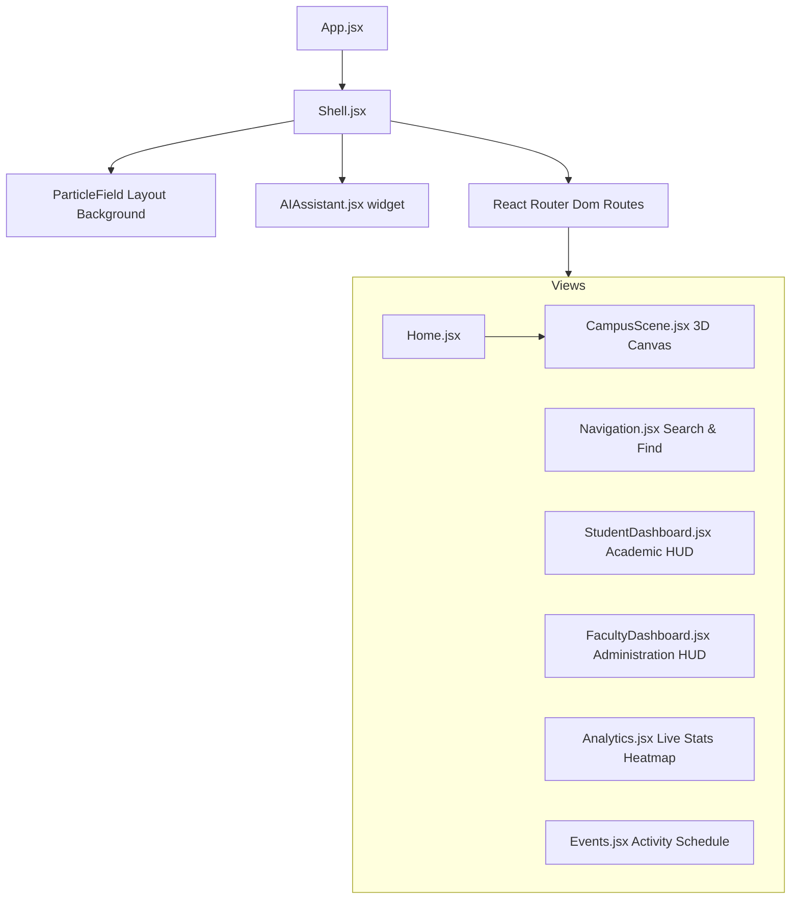

# Smart Campus Digital Twin Project Documentation

This document provides a comprehensive technical overview and feature guide for the **Smart Campus Digital Twin** workspace. The project serves as an interactive spatial dashboard for "Nexus University," providing 3D visualizations and operations hubs for students and faculty.

## 1. System Architecture

The application is built as a single-page application (SPA) using React, styled with Tailwind CSS, and powered by Three.js (via React Three Fiber) for web-based 3D rendering.



* **Core Framework**: React 18, React Router Dom v6
* **3D Viewport**: React Three Fiber (`@react-three/fiber`), `@react-three/drei`, and raw Three.js
* **Aesthetics & Motion**: Tailwind CSS v3, Framer Motion v11, and Lucide React icons
* **Tests & Verification**: Playwright v1.60.0

---

## 2. Directory Structure & Key Files

Below is a breakdown of the workspace layout and the responsibilities of each file:

* **[index.html](file:///c:/Users/user/Desktop/smart-campus-digital-twin-project/index.html)**: Sets up HTML shell, page title (`Nexus University Digital Twin`), viewport meta tags, theme color, and the root script mounting target.
* **[package.json](file:///c:/Users/user/Desktop/smart-campus-digital-twin-project/package.json)**: Declares application metadata, dependencies (React Three Fiber, Framer Motion, Tailwind), and scripts (`dev`, `build`, `preview`).
* **[tailwind.config.js](file:///c:/Users/user/Desktop/smart-campus-digital-twin-project/tailwind.config.js)**: Configures custom design system color variables (`void`, `primary`, `secondary`, `accent`, `panel`), fonts (Inter), custom box shadows (`glow`, `violet`), and animation properties.
* **[vite.config.js](file:///c:/Users/user/Desktop/smart-campus-digital-twin-project/vite.config.js)**: Configures bundler configurations and handles compilation settings.
* **[src/App.jsx](file:///c:/Users/user/Desktop/smart-campus-digital-twin-project/src/App.jsx)**: Declares routing mappings across the six central views and encapsulates them in a Framer Motion `<AnimatePresence>` wrapper for exit transitions.
* **[src/styles.css](file:///c:/Users/user/Desktop/smart-campus-digital-twin-project/src/styles.css)**: Holds custom Tailwind styles and design tokens (metallic grid backdrops, glassmorphism panel styles, and neon border gradients).
* **[src/data/campus.js](file:///c:/Users/user/Desktop/smart-campus-digital-twin-project/src/data/campus.js)**: Central data model of the application. Contains arrays detailing buildings (coordinates, occupancy rates, colors, sizes), locations list, daily timetable entries, upcoming campus events, and department summaries.
* **[src/hooks/useCounter.js](file:///c:/Users/user/Desktop/smart-campus-digital-twin-project/src/hooks/useCounter.js)**: A custom hook that creates a count-up transition effect on load, using a cubic-ease easing curve run via `requestAnimationFrame`.

---

## 3. Detailed Component Explanations

### Shell Layout ([Shell.jsx](file:///c:/Users/user/Desktop/smart-campus-digital-twin-project/src/components/layout/Shell.jsx))
Wraps all pages to provide a consistent global framework:
1. **Dynamic Navigation Menu**: Adapts to screen sizes, hiding the main links list behind a mobile drawer menu button (using a Framer Motion transition animation) on smaller viewports.
2. **Floating Particles**: Includes a background effect that paints interactive glowing micro-particles floating via CSS `@keyframes float`.
3. **AI Assistant integration**: Injects the floating Bot panel globally.

### 3D Scene viewport ([CampusScene.jsx](file:///c:/Users/user/Desktop/smart-campus-digital-twin-project/src/components/three/CampusScene.jsx))
Builds the core 3D simulation of the campus layout:
* **Fog and Lighting**: Adjusts lighting and background fog settings programmatically when day/night settings are modified on the home dashboard.
* **Interactive Buildings**: Renders buildings as meshes. Uses `useFrame` to animate building height positions up and down in a slow, floating pattern. Clicking a building highlights it and populates standard HTML cards overlayed via Drei's `<Html />` node.
* **Network Pathways**: Draws connecting route links between building groups as custom three-dimensional tubes (`TubeGeometry` generated by a `CatmullRomCurve3`). Animates the opacity over time to simulate active networking traffic.
* **Rotating Energy Rings**: Concentric, semi-transparent circles positioned around the coordinate system origin that rotate using the clock state elapsed time.

### UI Dashboard Components
* **[BarChart.jsx](file:///c:/Users/user/Desktop/smart-campus-digital-twin-project/src/components/dashboard/BarChart.jsx)**: A lightweight, reusable chart component using Framer Motion's `whileInView` to animate percentage indicators when they enter the viewport.
* **[MetricCard.jsx](file:///c:/Users/user/Desktop/smart-campus-digital-twin-project/src/components/dashboard/MetricCard.jsx)**: Flexible cards that load key metrics dynamically (e.g. attendance percentage, sensor counts) displaying tone styles (cyan, purple, green) matching custom color patterns.
* **[AIAssistant.jsx](file:///c:/Users/user/Desktop/smart-campus-digital-twin-project/src/components/AIAssistant.jsx)**: Provides a chat layout displaying initial guidance messages, clickable suggestion bubbles, a simulated chat log, and mock voice trigger options.

---

## 4. Main Navigation Pages

### Home (`/`)
* Entry point. Integrates the `<CampusScene />` directly.
* Includes dynamic statistics counters, selected building info sheets, and a Day/Night switcher widget.

### Navigation (`/navigation`)
* Built as a navigation console. Includes text query lookup capability filtering destinations (e.g. *AI Lab 402*, *Quantum Clean Room*).
* Interactive select dropdowns simulate path planning from access gates.

### Student Dashboard (`/student`)
* Personalized dashboard for students displaying general attendance rates, assignment due dates, and day-to-day timetable progress bars.

### Faculty Dashboard (`/faculty`)
* Operations center for teachers. Features a list of courses for marking and reviewing attendance, and department-level stats.

### Live Analytics (`/analytics`)
* Consolidates data summaries from all live sensors.
* Features a customized grid layout representing user movement density in a heatmap with color filters mapping activity levels.

### Events (`/events`)
* Lists registered expo and hackday meetups.
* Includes an registration selector that updates signup info, alongside a projected attendance progress gauge.

---

## 5. Development and Build Guide

### Prerequisites
Ensure that [Node.js](https://nodejs.org) is installed on your local computer.

### Start the Development Server
Run the local Vite builder server to start designing or exploring pages:
```bash
npm run dev
```
The console will host the bundle at `http://127.0.0.1:5173/`.

### Production Build
To create a production-ready package optimized for speed and fast loading times, run:
```bash
npm run build
```
The build artifacts are output to the `/dist` directory.

### Preview Release
Review the built version locally before launching it online:
```bash
npm run preview
```

---

## 6. Testing & Validation

The project contains a built-in testing script in the `work` directory called [verify-site.cjs](file:///c:/Users/user/Desktop/smart-campus-digital-twin-project/work/verify-site.cjs) that verifies the site compiles and runs cleanly. It uses **Playwright** to:
1. Boot up a headless chromium browser instance.
2. Visit the homepage and confirm that the Three.js `<canvas>` element mounts and loads.
3. Capture full-page viewport screenshots of both desktop and mobile layouts, saving them to the `outputs` directory.
4. Crawl all pages (`/navigation`, `/student`, `/faculty`, `/analytics`, `/events`) and print their `<h1>` headers to confirm correct page routing.
5. Watch for and throw errors on any javascript console logs or page exceptions.
